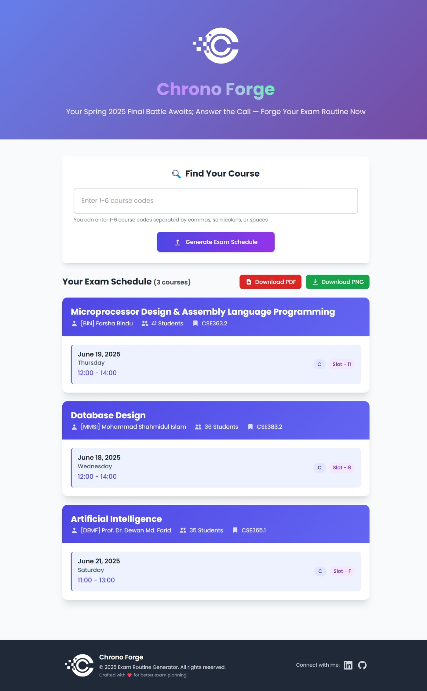

# 📚 Exam Routine Generator

<div align="center">
  
  
  <p><em>A modern, user-friendly web application to generate personalized exam routines</em></p>
  
  [](https://flask.palletsprojects.com/)
  [](https://www.python.org/)
  [](https://pandas.pydata.org/)
  [](https://www.reportlab.com/)
</div>

## ✨ Features

- 🔍 **Smart Course Search**: Enter up to 6 course codes simultaneously
- 📅 **Beautiful UI**: Modern, responsive design with Tailwind CSS
- 📄 **PDF Generation**: Download individual or combined exam schedules
- 🎨 **Interactive Design**: Animated transitions and professional styling


## 📸 Demo Screenshots

### Web Application Interface
<div align="center">
  
  <p><em>Modern and intuitive web interface for searching exam schedules</em></p>
</div>

### Generated PDF Output
<div align="center">
  
  <p><em>Professional PDF output with complete exam details</em></p>
</div>

## 🚀 Quick Start

### Prerequisites

- Python 3.7 or higher
- pip (Python package installer)

### Installation

1. **Clone the repository**
   ```bash
   git clone https://github.com/TanvirAnjumApurbo/routine_generator.git
   cd routine_generator
   ```

2. **Install dependencies**
   ```bash
   pip install -r requirements.txt
   ```

3. **Run the application**
   ```bash
   python app.py
   ```

4. **Open your browser**
   ```
   http://localhost:5000
   ```

## 📖 How to Use

### 🔍 Search for Courses

1. **Enter Course Codes**: Type your course codes in the search box
   - Separate multiple codes with commas, semicolons, spaces, or new lines
   - Example: `CSE341.1, EEE181.2, MAT120`

2. **Submit**: Click the search button or press Enter

3. **View Results**: Your exam schedule will display with:
   - Course code and title
   - Instructor name
   - Exam date and day
   - Start and end times

### 📄 Download Routine

- **PNGs**: Generate a PNG format routine with all your courses
- **PDF**: Generate a PDF routine with all your courses

## 🛠️ Technical Stack

### Backend
- **Flask**: Python web framework
- **Pandas**: Data manipulation and CSV processing
- **ReportLab**: PDF generation
- **Python DateTime**: Date formatting and manipulation

### Frontend
- **HTML5/CSS3**: Modern web standards
- **Tailwind CSS**: Utility-first CSS framework
- **JavaScript**: Interactive functionality
- **HTML2Canvas & jsPDF**: Client-side PDF generation

### Data
- **CSV Database**: Efficient exam data storage
- **460+ Course Records**: Comprehensive course database

## 📁 Project Structure

```
routine_generator/
├── app.py                  # Main Flask application
├── exam_data.csv           # Course and exam data
├── requirements.txt        # Python dependencies
├── README.md               # Project documentation
├── static/                 # Static assets
│   ├── logo.jpg            # Application logo
│   ├── book.png            # UI icons
│   ├── date.png
│   ├── find.png
│   └── pdf-template.js     # PDF generation utilities
└── templates/              # HTML templates
    ├── index.html          # Main application page
    └── routine_template.html  # PDF template
```

## 🎨 Features in Detail

### Smart Search System
- **Flexible Input**: Accept various separators (comma, semicolon, space, newline)
- **Case Insensitive**: Automatically converts to uppercase
- **Input Validation**: Prevents empty submissions and limits to 6 courses
- **Error Handling**: Clear feedback for invalid course codes

### Professional PDF Generation
- **Styled Documents**: Professional formatting with headers and tables
- **Course Details**: Complete information including instructor and timing
- **Downloadable**: Direct download with descriptive filenames

### Modern UI/UX
- **Gradient Backgrounds**: Beautiful color schemes
- **Smooth Animations**: Fade-in effects and hover transitions
- **Responsive Cards**: Clean, card-based layout
- **Icon Integration**: Visual elements for better user experience

## 🔧 Configuration

### Adding New Courses
Update the `exam_data.csv` file with the following columns:
- `Program`: Academic program
- `Slot`: Exam slot number
- `Date`: Exam date (DD.MM.YYYY format)
- `Start Time`: Exam start time
- `End Time`: Exam end time
- `Course Code`: Unique course identifier
- `Course Title`: Full course name
- `Student`: Number of students
- `Faculty`: Instructor name

### Customizing the UI
- Modify `templates/index.html` for layout changes
- Update CSS classes in the `<style>` section
- Add new icons to the `static/` directory

## 🤝 Contributing

1. Fork the repository
2. Create a feature branch (`git checkout -b feature/amazing-feature`)
3. Commit your changes (`git commit -m 'Add amazing feature'`)
4. Push to the branch (`git push origin feature/amazing-feature`)
5. Open a Pull Request

## 📝 License

This project is licensed under the MIT License - see the [LICENSE](LICENSE) file for details.

## 👥 Support

If you encounter any issues or have questions:

1. Check the [ISSUES](https://github.com/TanvirAnjumApurbo/routine_generator/issues) page
2. Create a new issue with detailed information
3. Contact with me

## 🎯 Future Enhancements

- [ ] User authentication system
- [ ] Course favorites and bookmarking
- [ ] Calendar integration
- [ ] Email notifications for exam reminders
- [ ] Multiple semester support
- [ ] Advanced filtering options
- [ ] Mobile app development

---

<div align="center">
  <p>Made with ❤️ for students everywhere</p>
  <p>Happy studying! 📚✨</p>
</div>